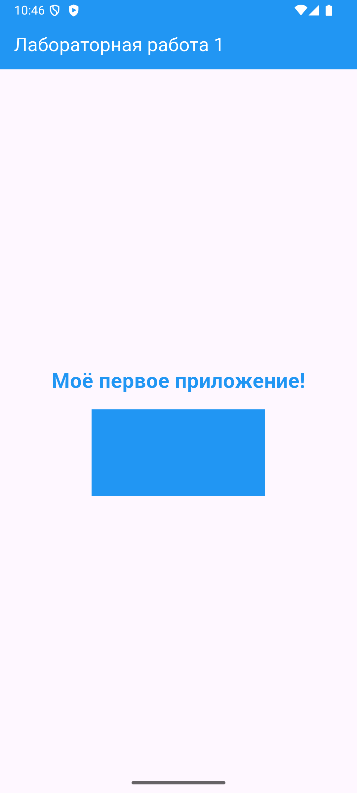

# СРС 1 — Основы разработки приложений на Flutter

Цель: создать и запустить первое Flutter-приложение, изменить текст, настроить его стиль и добавить цветной контейнер.

## Выполнение задания

Проект создан командой `flutter create --platforms=android --project-name=first_app srs1_first_app`.
Главный файл — [lib/main.dart](lib/main.dart).

На экране отображается сообщение «Моё первое приложение!». Для текста заданы `fontSize: 24`, `fontWeight: FontWeight.bold` и `color: Colors.blue`.
Под текстом расположен синий `Container`: ширина 200, высота 100 логических пикселей.
Между элементами добавлен `SizedBox(height: 16)`.

## Объяснение кода

- `main()` — начало выполнения программы; `runApp()` запускает приложение.
- `StatelessWidget` подходит для экрана, данные которого не меняются.
- `MaterialApp` задаёт приложение с оформлением Material.
- `Scaffold` содержит верхнюю панель `AppBar` и основную область `body`.
- `Center` размещает содержимое по центру.
- `Column` располагает элементы вертикально.
- `TextStyle` задаёт внешний вид текста.
- `Container` позволяет задать цвет и размеры прямоугольника.
- `const` используется для значений, известных заранее.

## Запуск и Hot Reload

```sh
flutter pub get
flutter run
```

Измените сообщение или цвет, сохраните файл и нажмите `r` в терминале. Hot Reload обновляет интерфейс без полного перезапуска приложения.
Для эксперимента можно изменить `fontSize` с 24 на 28, `FontWeight.bold` на `FontWeight.normal` или `Colors.blue` на `Colors.teal`.

## Результат проверки

Приложение собрано и запущено на Android-эмуляторе SRS1_Phone. Проверено отображение текста и контейнера, выполнен Hot Reload.
`flutter analyze` — без замечаний. `flutter test` — 1 тест пройден; проверяются наличие текста, размер прямоугольника и отсутствие ошибок построения.



