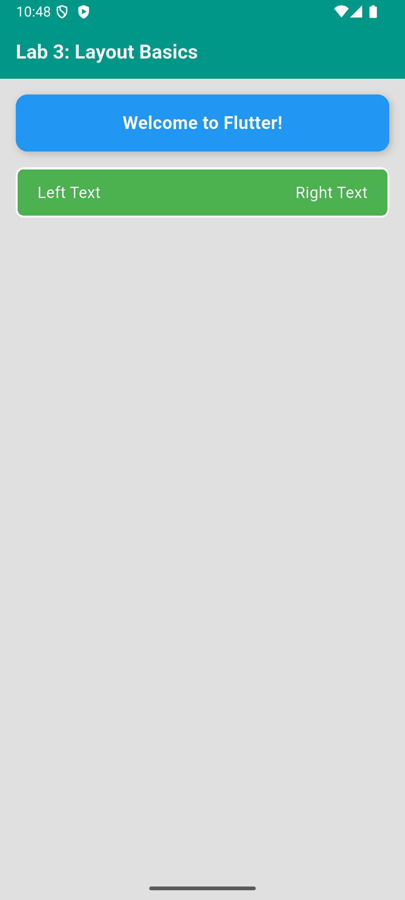

# СРС 2 — Основы макета Flutter

Цель: научиться размещать элементы с помощью Column и Row, задавать отступы и оформлять контейнеры.

Проект создан командой `flutter create --platforms=android --project-name=layout_basics srs2_layout_basics`.
Главный файл — [lib/main.dart](lib/main.dart).

## Выполнение задания

| Элемент | Настройки |
| --- | --- |
| AppBar | Заголовок «Lab 3: Layout Basics», фон Colors.teal |
| Заголовок | Белый, размер 20, жирный |
| Фон экрана | Colors.grey[300] |
| Основная компоновка | Column, два Container, между ними SizedBox высотой 16 |
| Первый контейнер | Синий, padding EdgeInsets.all(16), радиус углов 12 |
| Первый текст | «Welcome to Flutter!», белый, размер 18, жирный, в Center |
| Тень | Offset(2, 2), blurRadius 6, чёрный с прозрачностью 20% |
| Второй контейнер | Зелёный, padding по вертикали 12 и по горизонтали 20 |
| Рамка | Белая сплошная, толщина 2, радиус углов 8 |
| Строка | Row с MainAxisAlignment.spaceBetween |
| Тексты строки | «Left Text» и «Right Text», белые, размер 16 |

Заголовок «Lab 3: Layout Basics» сохранён в точности из условия СРС 2.
В современном Flutter вместо устаревшего `withOpacity(0.2)` используется `withValues(alpha: 0.2)`: в этой работе оба варианта задают ту же прозрачность.

## Объяснение кода

`Column` располагает блоки сверху вниз. `CrossAxisAlignment.stretch` растягивает их на доступную ширину.
`Row` располагает два текста горизонтально; `MainAxisAlignment.spaceBetween` разносит их по противоположным краям.

`Padding` с `EdgeInsets.all(16)` отступает от краёв экрана. Свойство `padding` каждого контейнера создаёт пространство между его границей и содержимым.
`margin` — свойство Container для внешнего отступа, а не отдельный виджет. В этом макете расстояние между блоками задано через `SizedBox`, как требует условие.

`BoxDecoration` объединяет цвет фона, скругление, тень и рамку. Если цвет указан внутри `decoration`, отдельно задавать `color` этому же Container не нужно.
`SafeArea` защищает содержимое от системных вырезов и панелей.

## Запуск и проверка

```sh
flutter pub get
flutter run
flutter analyze
flutter test
```

Анализатор не обнаружил замечаний. Тест проверяет четыре надписи, взаимное расположение текстов в строке и отсутствие ошибок построения на экране 400 × 800 логических пикселей.


`flutter run`: приложение собрано и запущено на Android-эмуляторе SRS1_Phone, внешний вид проверен по скриншоту.
